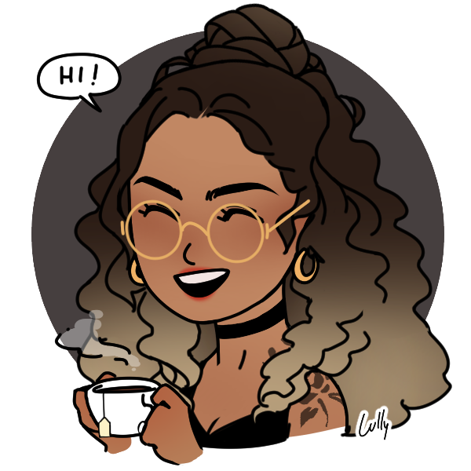

### Hello World, I'm Yasmim 👋

## I'm a Fullstack Developer!!

- 👩🏽‍💻 Pronouns: She/Her
- 🎓 I'm currently doing a degree in information systems.
- 🌱 I’m currently improving my Java skills
- 👯 I’m looking to collaborate on open source projects, if you have any tips i would love to hear!
- 🕵🏽‍♀️ I am an information security enthusiast and I love to study topics related to it!
- 😄 Fun fact: When i'm bored i like to dye my hair

### Talk with me, you can find at LinkedIn!

[][linkedin]

 
 

### I'm used to work with:

 
 

### But I also know:

[linkedin]: https://www.linkedin.com/in/yasmim-cavalcanti/
